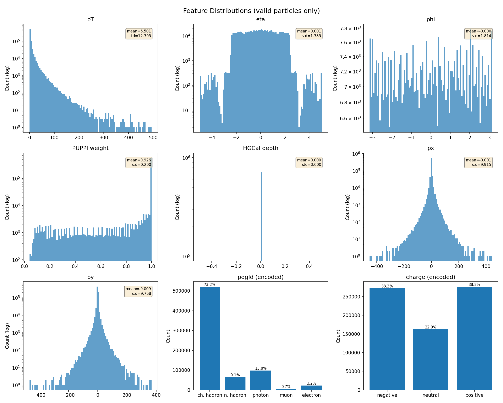
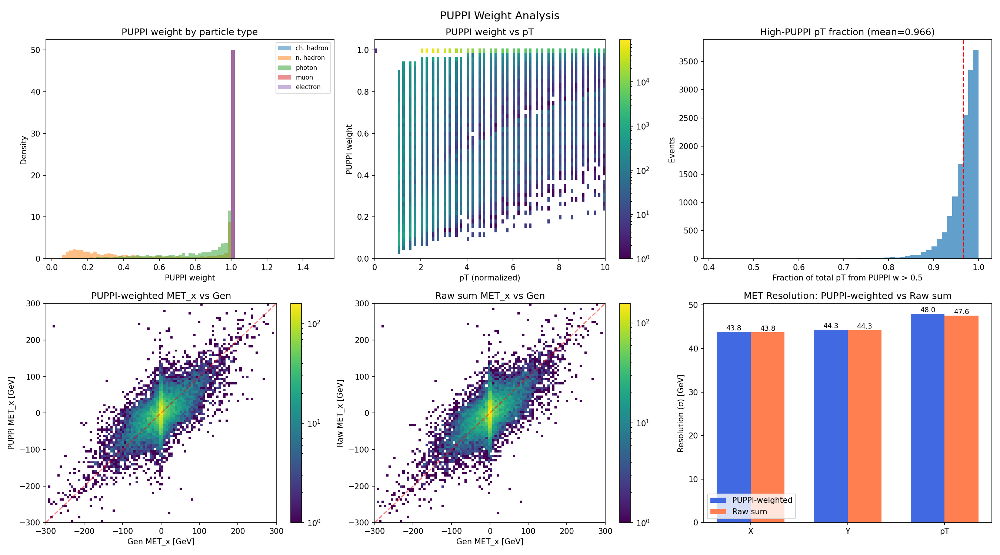
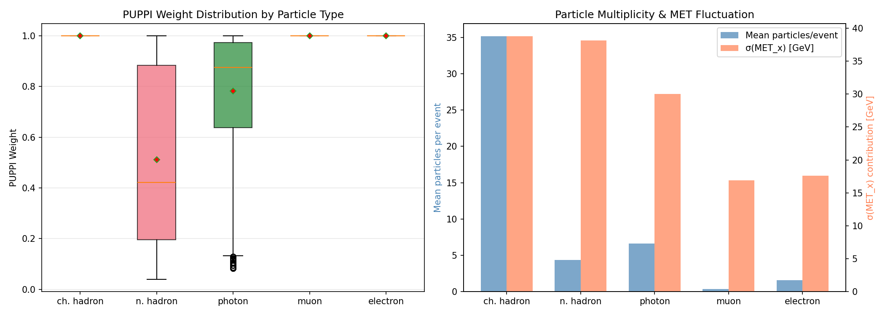
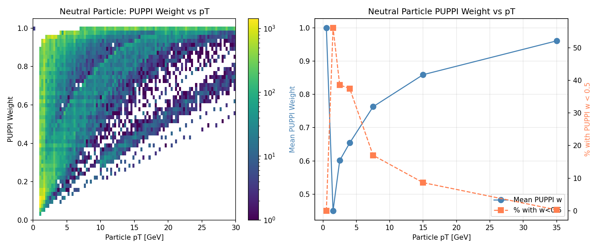
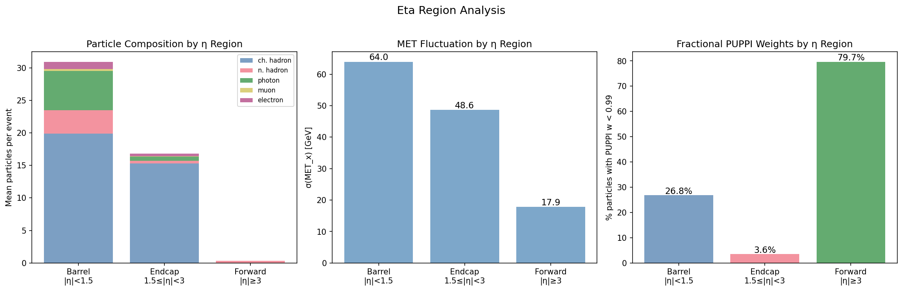
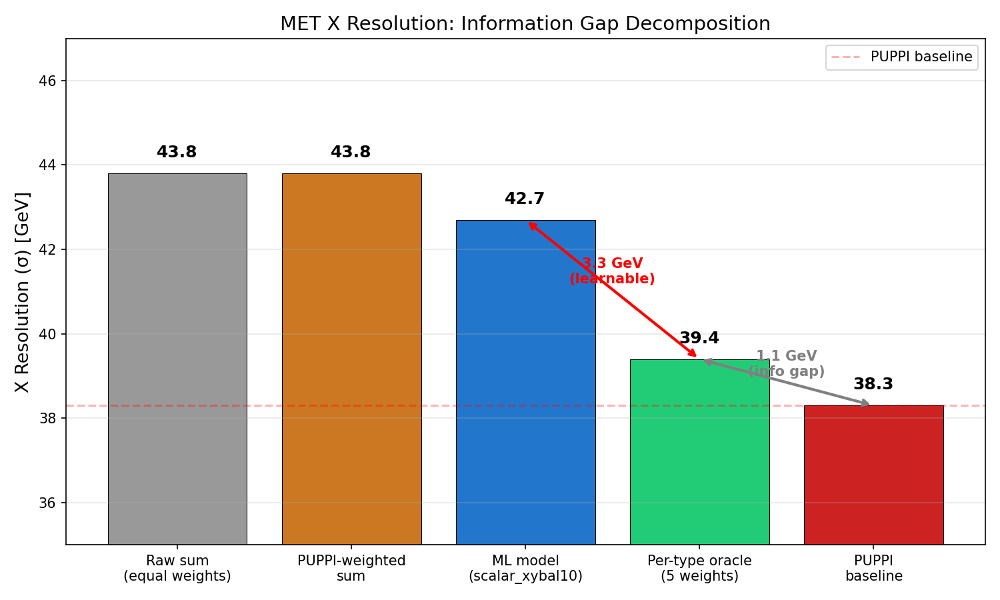
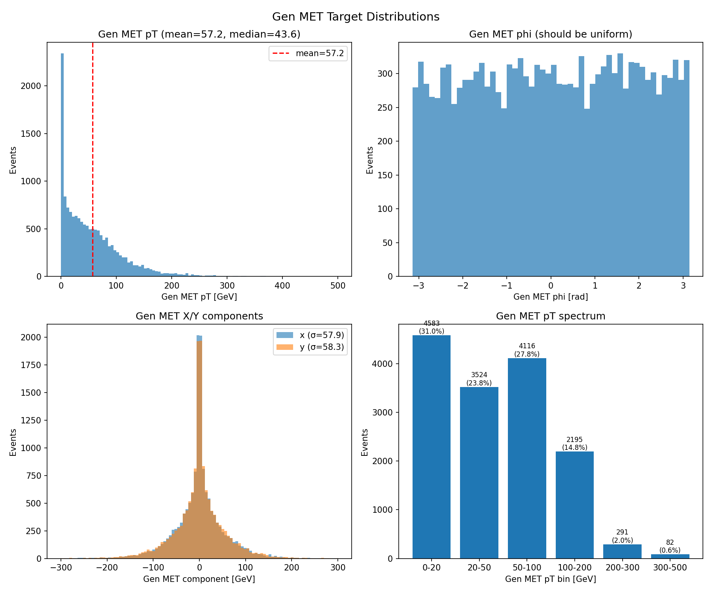
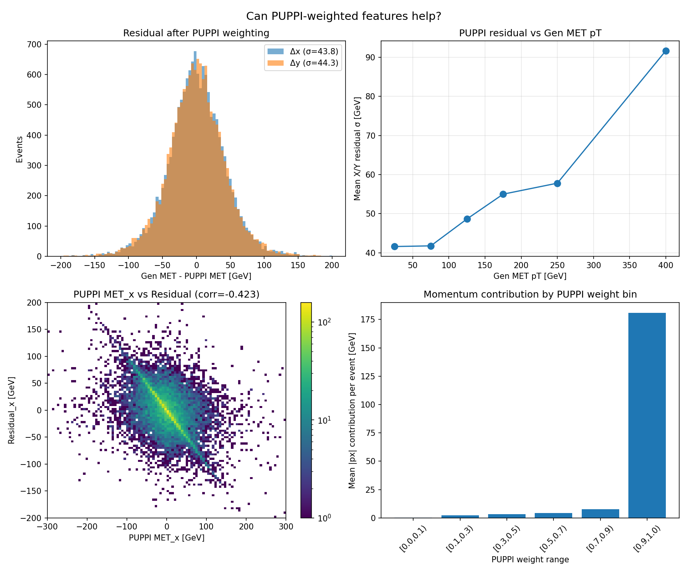

# Data Exploration: Understanding the Feature Space and Information Gap

**Date**: April 4, 2026
**Context**: Following the resolution gap study (42.7 vs 38.3 GeV X/Y resolution), this study investigates the data itself to understand what information the model has access to, what PUPPI uses that we don't, and where the resolution floor comes from.

**Data**: Test split (14,800 events) from `preprocessed/25Jul8_140X_v0` (TT_PU200 + VBFHToInvisible_PU200).

## 1. Particle Occupancy

| Metric | Value |
|--------|-------|
| Total slots | 1,894,400 (14,800 events × 128) |
| Valid particles | 710,651 (37.5%) |
| Mean per event | 48.0 |
| Median | 46 |
| Min / Max | 3 / 128 |

62.5% of slots are zero-padded. The 128-candidate limit is rarely hit — only events at the tail of the multiplicity distribution saturate.



## 2. Feature Statistics

| Feature | Min | Max | Mean | Std | Notes |
|---------|-----|-----|------|-----|-------|
| pT | 0.0 | 493.8 | 6.5 | 12.3 | Raw GeV, not normalized |
| eta | -5.03 | 5.03 | 0.0 | 1.38 | Full detector coverage |
| phi | -3.14 | 3.14 | 0.0 | 1.81 | Uniform |
| PUPPI weight | 0.039 | 1.0 | 0.926 | 0.200 | **81% are exactly 1.0** |
| HGCal depth | 0.0 | 0.0 | 0.0 | 0.0 | **All zeros — dead feature** |
| px | -451.9 | 442.5 | 0.0 | 9.9 | Raw GeV |
| py | -466.2 | 369.0 | 0.0 | 9.8 | Raw GeV |

**Key finding**: HGCal depth carries zero information in the current dataset. This feature slot is wasted.

## 3. PUPPI Weight Analysis — The Critical Finding

### PUPPI weights are nearly binary



| Particle Type | Mean PUPPI w | Std | Count | % of total |
|---------------|-------------|-----|-------|------------|
| Charged hadron | **1.000** | 0.000 | 520,392 | 73.2% |
| Muon | **1.000** | 0.000 | 5,150 | 0.7% |
| Electron | **1.000** | 0.000 | 22,708 | 3.2% |
| Photon | 0.784 | 0.229 | 98,024 | 13.8% |
| Neutral hadron | 0.511 | 0.337 | 64,377 | 9.1% |

**All charged particles have PUPPI weight = 1.0.** Pileup charged particles were already rejected upstream by the PUPPI algorithm using vertex association — they simply don't appear in our input. The PUPPI weight feature is only informative for the ~23% of particles that are neutral.

### Consequence: PUPPI-weighted sum ≈ raw sum

Because 81% of particles have w=1.0:
- **PUPPI-weighted MET resolution**: X=43.8, Y=44.3 GeV
- **Raw sum MET resolution**: X=43.8, Y=44.3 GeV
- **Ratio**: 1.00 (identical)

The PUPPI weights stored in our features do NOT reproduce the official PUPPI MET calculation. The discriminating step (charged pileup rejection via vertex association) happened before our data was created.



## 4. Neutral Particle PUPPI Weight vs pT

For neutral particles, PUPPI weight strongly correlates with pT:

| pT range [GeV] | Mean PUPPI w | % with w < 0.5 |
|-----------------|-------------|-----------------|
| 0–2 | 0.450 | 56.1% |
| 2–5 | 0.626 | 38.1% |
| 5–10 | 0.763 | 17.0% |
| 10–50 | 0.905 | 4.8% |
| 50–500 | 0.998 | 0.0% |

Low-pT neutrals are the main source of ambiguity — these are the particles where the model must learn to distinguish pileup from hard scatter using only pT, eta, and phi.



## 5. Eta Region Analysis



| Region | Particles/event | σ(MET_x) [GeV] | % fractional PUPPI w |
|--------|----------------|-----------------|----------------------|
| Barrel (|η|<1.5) | 30.9 | 64.0 | 26.8% |
| Endcap (1.5≤|η|<3) | 16.8 | 48.6 | 3.6% |
| Forward (|η|≥3) | 0.3 | 17.9 | 79.7% |

The barrel dominates both particle count and MET fluctuations. Barrel particles contribute the most noise, and the barrel has the highest fraction of ambiguous neutral particles. This is where the model's per-particle weighting needs to be most accurate.

## 6. Information Gap Decomposition

The central analysis: decomposing the X resolution gap into learnable and fundamental components.



| Strategy | X Res [GeV] | Gap to PUPPI |
|----------|------------|--------------|
| Raw/PUPPI sum (equal weights) | 43.8 | +5.5 |
| **ML model** (scalar_xybal10) | **42.7** | **+4.4** |
| Per-type oracle (5 constant weights) | 39.4 | +1.1 |
| **PUPPI baseline** | **38.3** | 0 |

### Optimal per-type weights (least-squares fit):

```
gen_MET_x ≈ 0.748 × ch_hadron + 0.692 × ne_hadron + 0.661 × photon + 0.469 × muon + 0.609 × electron
Residual σ = 39.4 GeV
```

### Gap decomposition:

1. **Model → Per-type oracle: 3.3 GeV (learnable)**
   The model should be able to learn per-type-dependent weights from pdgId embeddings. The 3.3 GeV gap suggests the model is not fully exploiting per-type and per-event variation. Addressable with:
   - More training data (118k → 500k+)
   - Inter-particle attention (particles processed independently today)
   - Architecture capacity (current 3-layer Dense is a shallow independent processor)

2. **Per-type oracle → PUPPI: 1.1 GeV (information gap)**
   This represents information PUPPI has that our 9 features don't: vertex association, track quality, primary vertex compatibility. Not addressable without adding new features.

### Per-group optimal weights:
```
gen_MET_x ≈ 0.708 × charged_MET + 0.686 × neutral_MET
Residual σ = 39.7 GeV
```

Even a 2-parameter (charged vs neutral) oracle achieves 39.7 GeV — close to the 5-parameter result. The dominant effect is simply downweighting all particles by ~0.7.

### Oracle per-event analysis:

With per-particle-per-event oracle weights, the system is underdetermined (2 equations, ~48 unknowns) — residual = 0. The bottleneck is the **model's ability to predict correct weights from features**, not the reduction from particles to MET.

## 7. Charged vs Neutral MET Fluctuations

| Group | Mean particles/event | σ(MET_x) [GeV] |
|-------|---------------------|-----------------|
| Charged (hadrons + muons + electrons) | 37 | 40.0 |
| Neutral (hadrons + photons) | 11 | 49.1 |
| Combined | 48 | 60.7 |

Despite being only 23% of particles, neutrals contribute **more** MET fluctuation than charged particles. This is because neutral particles have higher pileup contamination (fractional PUPPI weights) and the model has less information to identify them (no vertex association).

## 8. Gen MET Target Distributions



| Metric | Value |
|--------|-------|
| Mean pT | 57.2 GeV |
| Median pT | 43.6 GeV |
| σ(pT) | 59.0 GeV |
| σ(MET_x) | 57.9 GeV |
| σ(MET_y) | 58.3 GeV |

The pT spectrum is steeply falling — 50% of events have gen MET < 44 GeV. High-pT events (>200 GeV) constitute only ~5% of the dataset but dominate the resolution metric. With only 118k training events, the model sees ~6k events above 200 GeV.



## 9. Recommendations

### Immediate (no new data needed):

1. **Remove or replace HGCal depth** — it's all zeros. Either the preprocessing is dropping this info or the input ROOT files don't contain it. Investigate and fix, or replace with a useful feature (e.g., |eta| or pT rank within the event).

2. **Add event-level features**: Total scalar pT sum, number of valid particles, and mean PUPPI weight could help the model learn event-dependent scaling.

3. **Stratified sampling by gen MET pT**: The current uniform sampling under-represents high-pT events that matter most for resolution. Oversampling the 200+ GeV tail could help.

### With more data (Spring24):

4. **Target 500k+ events**: The per-type oracle analysis shows the model has room to learn but may lack statistics, especially in the high-pT tail.

5. **Investigate if Spring24 samples include HGCal depth**: If the perfNano production is updated, this feature could become informative.

### Architecture:

6. **Inter-particle communication**: The per-type oracle achieves 39.4 GeV with global weights, but the event-dependent variation suggests particle correlations matter. An attention or mixer layer would allow the model to learn "this neutral hadron is near a jet" type reasoning.

## 10. Plots

All plots in `reports/data_exploration/`:
- `feature_distributions.png` — All 9 feature distributions (valid particles)
- `puppi_weight_analysis.png` — PUPPI weight by type, vs pT, resolution comparison
- `puppi_weighted_features.png` — Residual analysis, correlation, momentum by PUPPI bin
- `particle_type_met.png` — Multiplicity and MET fluctuation by particle type
- `particle_type_breakdown.png` — Boxplot of PUPPI weights + multiplicity/fluctuation bars
- `gen_met_distributions.png` — Target pT/phi/X/Y distributions and spectrum
- `information_gap_decomposition.png` — Bar chart of resolution gap decomposition
- `eta_region_analysis.png` — Particle composition, MET fluctuation, PUPPI w by eta
- `neutral_puppi_vs_pt.png` — Neutral particle PUPPI weight dependence on pT
