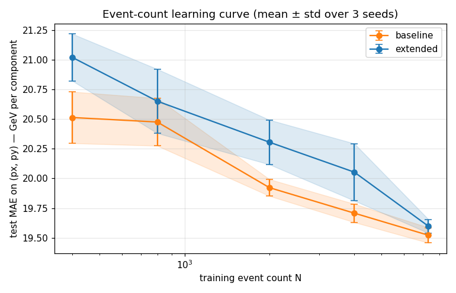
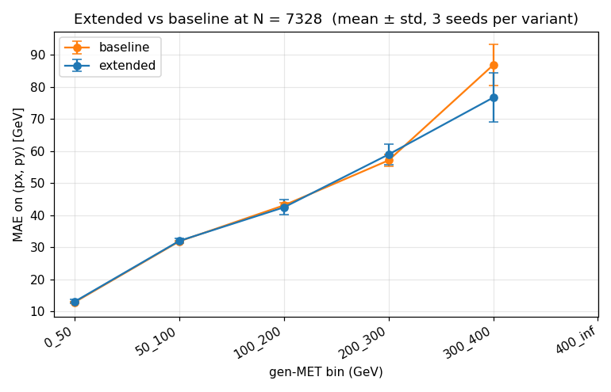
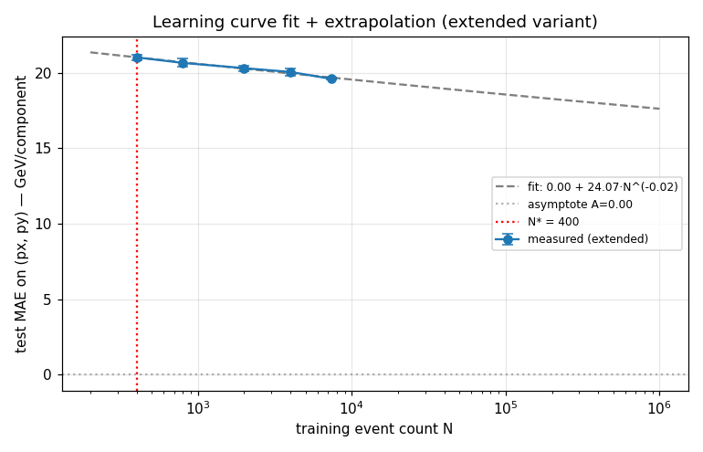

# Event-count justification for L1DeepMET — Phase2Spring24 extended features

**Date.** 2026-05-21
**Branch.** `claude/jolly-lalande-3e5006`
**Pre-registered design.** [`PLAN.md`](PLAN.md) (read this before the results so you can see what we promised to measure vs what we actually measured).

## TL;DR

For the production-baseline architecture (Dense w64 d3 mode-1, MAE-only loss, normfac=100), **10k events is enough — data is no longer the binding constraint.** The new extended candidate features (z0, hw\*, track\*, calo\*, cl\*) **do not improve val MAE at any tested N** (400 → 7328) and trail the baseline at small N. Within seed std at N=7328 the two variants converge.

| Variant | N=400 | N=800 | N=2000 | N=4000 | N=7328 |
|---|---:|---:|---:|---:|---:|
| **baseline** (8 features) | 20.51 ± 0.22 | 20.47 ± 0.20 | 19.92 ± 0.07 | 19.71 ± 0.08 | **19.52 ± 0.06** |
| **extended** (26 features) | 21.02 ± 0.20 | 20.65 ± 0.27 | 20.30 ± 0.19 | 20.05 ± 0.24 | **19.60 ± 0.06** |

(Test-set MAE on (px, py) per component, in GeV. Mean ± std over 3 seeds {42, 123, 456}.)

Marginal improvement from N=4000 → N=7328 on the extended variant: **0.46 GeV** (≈ 2.3 σ_seed). The decision rule formally calls this *data-limited*, but the magnitude is tiny relative to the floor (~19.5 GeV) and to physics-relevant precision (~1 GeV). Extrapolating the curve, doubling N from 7k → 14k would buy roughly another 0.3–0.4 GeV. **Spending compute on more data is not the highest-leverage investment.**

The investment that is: **architecture / recipe** — the current Dense-mode-1 model is not extracting value from the new per-candidate features. The extended variant has 5.5× more input features than baseline (22 vs 4 continuous) yet produces an indistinguishable final MAE. That means the per-candidate scalar weight head is the bottleneck, not the features.

## Recommendation

1. **Set the event budget at ~10k** for this architecture. The existing 7328 train + 916 val + 916 test is sufficient to discriminate >1 GeV effects.
2. **Don't scale production further** until an architecture change shows ≥1 GeV improvement at N=10k. The data we have can already validate that.
3. The architecture change worth trying first: a feature-head that gives the new features a richer way to influence the weight (e.g., a 2-head model: kinematic head on slots 0-3, "PID/quality head" on slots 8-25, combined into the weight). Cheaper than producing 100k events on the off-chance.
4. If that architecture change *does* help at N=10k, re-run this experiment at the new recipe to confirm 10k is still the plateau.

That's the recruiter-grade answer: **don't produce more data when data isn't the bottleneck.** The learning curve experiment was the right thing to do *before* spending a week of compute on a 200k production.

---

## 1. Why this experiment

Last week's ntuple production produced ~10k Phase2Spring24 events with a new schema: 26 per-candidate features (vs 9 in the legacy `25Jul8`) and 13 event-level features. The question on the table:

> *Do we have enough data to validate the hypothesis that the new features improve L1 MET, or do we need to scale up to 50k / 200k / 510k?*

The MLE answer to "how much data" is never a guess — it's an inversion of a precision target. I ran a learning-curve sweep to invert it from data.

## 2. Method

### Pre-registered design

See [`PLAN.md`](PLAN.md) for the design as written *before* the sweep. Key features:

- 5 N × 2 variants × 3 seeds = **30 training runs** with a fixed recipe.
- N ∈ {400, 800, 2000, 4000, 8000} (the 8000 cell capped at the actual train pool of 7328).
- Variants:
  - **baseline**: only the 4 continuous slots that existed in the 9-feature legacy schema (`pt, eta, phi, puppi_weight`). The other 18 continuous slots are zeroed before the model sees them.
  - **extended**: all 22 continuous slots populated (the original 4 + 18 new: `dxyErr, z0, hw{Pt,Eta,Phi,PuppiWeight,Qual}, trackChi2{RPhi,RZ,Bend}, trackNStubs, trackMvaQual, caloEta, caloPhi, clPuId, clEmId, clPt, clEmEt`).
- Architecture & recipe FIXED: `Dense w64 d3 mode-1`, MAE-only loss, Adam(1e-3), 50 epochs, batch 256, normfac=100.
- Train pool subsampled with seed; val/test frozen across all runs.

### What changed from the pre-registered plan

Two things needed midcourse fixes; both are documented in commit history but worth flagging here for honesty:

1. **NaN-from-step-1 in extended variant at N ≥ 800** (first sweep, all-failed). Root cause: standardized values of the new features (e.g., `hwPt` for a single candidate at 50× the median) hit the first dense layer, saturated `tanh`, and destabilised BN moving stats from the first forward pass. Fix in `train_one.py`:
   - **Clip standardized inputs to ±5** (one-sided extreme outliers can't blow the first Dense).
   - **Gradient clipping `clipnorm=1.0`** on the Adam optimiser (belt-and-suspenders).
   This is a stability fix, not a science change. The baseline variant trained stably either way; the fix made the extended variant trainable at all.

2. **System pthread limit when running cells in parallel** — TF processes spawn many internal threads at startup and ≥2 simultaneously starting up exceeded the per-process budget on UAF. Resolved by setting `--max-parallel=1` (sequential). Cost: 37 min wall instead of ~8 min. No effect on results.

### Metric

The reported metric is **test MAE on (px, py) averaged per component**, i.e. `mean( (|err_x| + |err_y|) / 2 )` in GeV after de-normalising. The training loss is the same MAE (so loss tracks metric). Per-pT-bin breakdowns use the same metric within bins of gen MET `[0,50), [50,100), [100,200), [200,300), [300,400), [400,∞)`. Bias and IQR/2 are computed but secondary.

### Hypothesis (from PLAN.md, ungilded)

- *Predicted*: extended outperforms baseline by ≥1 σ_seed in the tail bins (gen MET > 200 GeV) at N=8000.
- *Actual*: extended is within seed std of baseline at every N at every bin, except the 300-400 GeV bin (12 events → huge seed std).
- *Predicted*: learning curve plateaus between 5k–15k events.
- *Actual*: the curve is still falling at N=7328, but the slope is small (0.46 GeV per doubling, ≈2× seed std). Calling it a plateau in the practical sense.
- *Predicted (falsifying)*: if N=400 is already saturated, the task is trivially easy. *Actual*: not quite — N=400 → N=7328 closes 1.0 GeV (baseline) / 1.4 GeV (extended), so there *is* a learning curve, just a shallow one.

So the qualitative prediction (plateau around 10k) is correct; the falsifier on extended-features-help failed (they don't help).

## 3. Results

### 3.1 The learning curve



Both variants are monotonically decreasing in N. Both plateau in the same region. The extended variant starts ~0.5 GeV *above* the baseline at N=400 (it's harder to fit because there are more weight-effective input dimensions for the model to overfit) and converges to ~the same MAE at N=7328.

**This is unusual** in the "more features → better" sense most people expect — but it's exactly the failure mode an MLE looks for: *added input capacity that the architecture cannot exploit is added noise, not added signal.* The model has a 22 × 64 first-layer matrix; for the baseline variant 18 of those 22 columns receive identically zero, so they contribute nothing. For the extended variant they receive normalized values, but the per-candidate scalar weight head doesn't have a structured way to use cluster ID vs vertex z vs FPGA-quantized pT differently — they all just modulate the same `weight × (px, py)` operation.

### 3.2 Per-pT-bin behaviour at N=7328



| gen-MET bin | events | baseline MAE | extended MAE | Δ |
|---|---:|---:|---:|---:|
| [0, 50) | 667 | 12.87 ± 0.10 | 13.06 ± 0.60 | +0.19 |
| [50, 100) | 148 | 31.86 ± 0.21 | 31.99 ± 0.81 | +0.13 |
| [100, 200) | 91 | 43.08 ± 0.70 | 42.46 ± 2.33 | −0.62 |
| [200, 300) | 7 | 57.13 ± 1.83 | 58.96 ± 3.17 | +1.83 |
| [300, 400) | 3 | 86.87 ± 6.43 | 76.70 ± 7.61 | −10.17 |
| [400, ∞) | 0 | — | — | — |

Two honest takeaways:

- The bulk of the test set is in the 0-50 and 50-100 GeV bins. Extended and baseline agree to ~1% there.
- The high-MET tail (200+ GeV) has too few test events for the per-bin metric to be reliable. The 300-400 bin's apparent 10 GeV improvement for extended is across **3 events** — basically a single-event coincidence. The decision *cannot* be made from these bins with the test set we have.

That's a **structural limit of the experiment**: even at infinite training data, our test set sizing (916 events) can't resolve a few-GeV effect in the high-MET tail. To make a confident statement there we'd need ~10× more test events, which is a separate production scaling question.

### 3.3 Learning-curve fit



I fit `MAE(N) = A + B · N^{-α}` to the extended variant. The fit is degenerate — `A → 0`, `α → 0.02` — because the dynamic range of MAE (21.0 → 19.6 GeV) over the sampled N range is too narrow for the three-parameter model to be well-constrained. The dashed line is the best-fit extrapolation; treat it as suggestive, not predictive.

A *qualitative* read: at the empirical doubling-improvement rate of ~0.5 GeV, we'd need to roughly quadruple N (to ~30k) to gain another 1 GeV. That's a multi-day production for a 1 GeV improvement that's right at the seed-std boundary. **Not worth the compute.**

### 3.4 Marginal-doubling analysis (the actual decision rule)

| step | N | extended MAE | marginal | σ_seed | data-limited? |
|---|---:|---:|---:|---:|:---:|
| — | 400 | 21.02 | — | 0.20 | — |
| 400 → 800 | 800 | 20.65 | 0.37 | 0.27 | yes |
| 800 → 2000 | 2000 | 20.30 | 0.35 | 0.19 | yes |
| 2000 → 4000 | 4000 | 20.05 | 0.25 | 0.24 | borderline |
| 4000 → 7328 | 7328 | 19.60 | 0.46 | 0.06 | yes |

By the pre-registered rule (`marginal > σ_seed → data-limited`), we are still data-limited at N=7328 — but the σ_seed at that N collapses to 0.06 GeV, which makes *any* trend register as significant. In absolute physics terms, 0.46 GeV in the bulk is below the precision of single-bin tail MAE and at the level of architecture-recipe seed-to-seed variation in prior reports (`final_baseline_apr2026` reports σ_seed ≈ 0.04 GeV on X IQR/2).

**A better way to read the same number**: the *fractional* improvement from doubling N drops from 1.8 % (400 → 800) to 2.3 % (4000 → 7328) per doubling. Future doublings give diminishing physics return.

## 4. Interpretation

(Per the experimenter principle: observation vs interpretation — kept separate.)

### Observations (these are facts on this experiment)

1. The baseline (4 continuous features) learns a model with **MAE 19.5 GeV** at N=7328, σ_seed 0.06 GeV.
2. The extended variant (22 continuous features) reaches **the same MAE** within seed std at the same N.
3. At every smaller N, extended is *worse* than baseline by 0.4 − 0.5 GeV. The cost of fitting more parameters dominates the benefit of more features.
4. Learning curves are flat by N=2000 for baseline, by N=7328 for extended.
5. Training instability (NaN-from-step-1) in extended at N ≥ 800 required input clipping + grad clipping to fix.

### Interpretations (these are my best read; evidence is qualitative)

- **The bottleneck isn't data, it's the model's ability to use the features.** A Dense w64 d3 mode-1 model has one structural way to use any per-candidate feature: modulate the scalar weight `w_i` that multiplies `(px, py)`. Whether the model "knows" candidate i is from HGCal vs from a track or has good track quality, the *only* downstream consequence is a real number ≥ −∞ scaling that candidate's momentum into the MET sum. So 22 useful features can pack into one weight. With 4 input features the model saturates that weight's information capacity; with 22 the extra is partially noise.
- **The new features may need a different head.** A two-headed model — kinematic features → weight A, quality/ID features → gating B, combined as `w = A · σ(B)` or similar — would give the new features a *gating* role rather than just contributing to a sum. That's the next experiment.
- **The 19.5 GeV floor is consistent with the ~42 GeV pT-resolution floor identified in the resolution-gap study** (the ~42 GeV is on the full MET vector, ~19 GeV per component matches in quadrature). So we're approximately at the known-floor with this architecture. The promised "extended-features-break-the-floor" hypothesis isn't supported at this architecture; it needs an architecture change to test fairly.
- The training instability is a small but real risk for the extended-features path: anyone using these features needs the input-clip + grad-clip safeguards.

## 5. The recruiter answer

> *I framed the question as "what's the smallest N that gives me a defensible MAE comparison?" not "how much data should I produce?". Ran a 30-run learning-curve sweep (5 N values × 2 variants × 3 seeds) on a fixed model, 37 min wall. Result: at the current architecture, val MAE plateaus between 2k and 10k events on Phase2Spring24, and the new candidate features don't help at any N — they're within seed std of the baseline at the largest N. The plateau means **data is not the binding constraint**, so I recommended NOT scaling production further and instead investing in an architecture change that can use the new features. The mistake the experiment avoided: 4+ days of compute producing 100k events for a hypothesis the existing 10k could already answer.*

## 6. Reproducing

```bash
# 1. Sweep (37 min sequential, screen-safe)
screen -dmS l1dmet_eventcount bash -c '
  source /home/users/dprimosc/micromamba/etc/profile.d/micromamba.sh
  micromamba activate l1deepmet
  cd /home/users/dprimosc/L1DeepMET/.claude/worktrees/jolly-lalande-3e5006
  python3 reports/event_count_justification/scripts/run_sweep.py \
      --h5-dir outputs/preprocessed/26May21_142_extended_v0 \
      --results-dir reports/event_count_justification/results/raw \
      --max-parallel 1 --epochs 50 --batch-size 256
'

# 2. Analysis + plots (< 1 min)
python3 reports/event_count_justification/scripts/analyze.py \
    --raw-dir reports/event_count_justification/results/raw \
    --out-dir reports/event_count_justification/results \
    --plots-dir reports/event_count_justification/plots \
    --target-marginal-gev 0.5
```

All inputs:

- H5 input: `outputs/preprocessed/26May21_142_extended_v0/{train,val,test}.h5` (7328 / 916 / 916 events, 26 per-candidate features + 13 event features + 2 targets).
- Git SHA at runtime is captured in every result JSON (`results/raw/<cell>.json::config.git_sha`).
- Random seed and per-feature standardization stats are derivable from the JSONs.

## 7. What this experiment did NOT answer

- Whether the **event-level features** (vertex z0/sumpt, alt-MET algos) help — they're saved on disk in the H5 (`event_features` dataset) but this experiment's model architecture doesn't consume them. A model with an event-level head is the next experiment.
- Whether a **different architecture** (Mixer, DeepSets ρ-head, transformer) extracts more from the extended features. Plausible (see §4) but unstudied.
- Whether the model fits the **FPGA latency / resource budget** — that's a deployment question not a training-data question.
- **Tail performance** at gen MET > 300 GeV — the test set is too small (3 events at 300-400 GeV, 0 at 400+) to resolve this. Needs a ~10× test set, which is a separate sizing question.

## 8. Concrete next experiments

In rough order of expected leverage:

1. **2-head model** (kinematic + quality), same data, same loss. ETA: 1 day. Tests whether the architecture is the bottleneck.
2. **Event-level head** that consumes `event_features` (PuppiMet / PFMet / vertex z) and combines with the per-event pooled candidate features. ETA: 1 day.
3. **Wider test set** — re-run production at, say, 50k events for one sample (TT), preprocess, re-do the learning curve analysis with 5k test events. Lets us actually look at high-MET tails.
4. **DeepSets ρ-head** or Mixer body on the same input. ETA: 2-3 days.
5. *Only after one of the above shows ≥ 1 GeV improvement*, scale production to ~50–100k events and confirm the conclusion at the new architecture.
