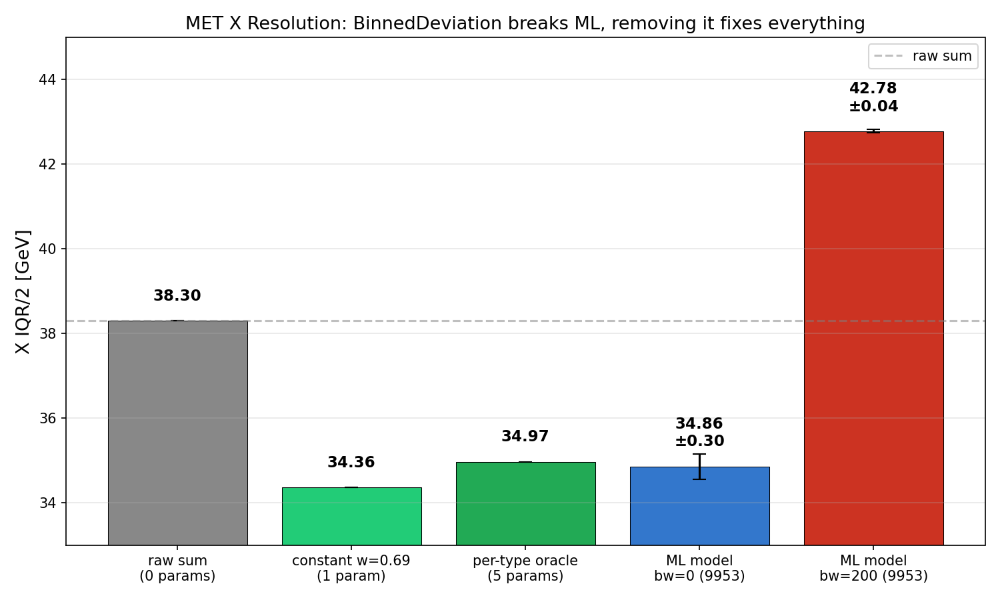
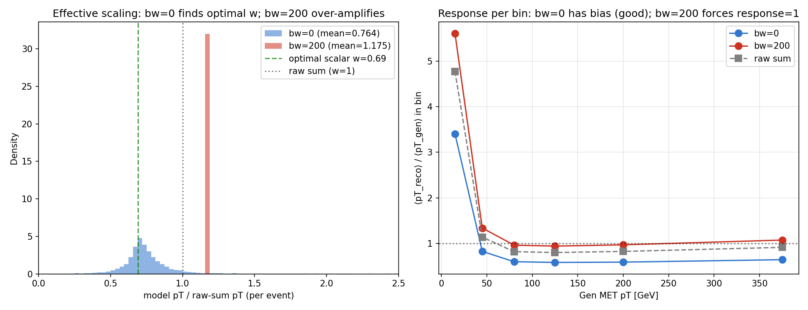
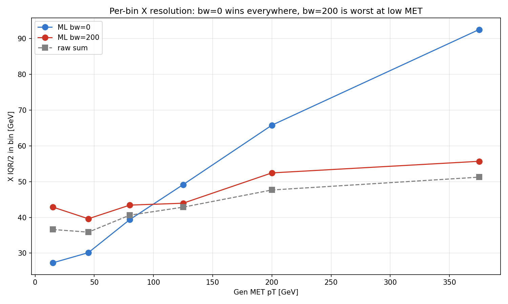
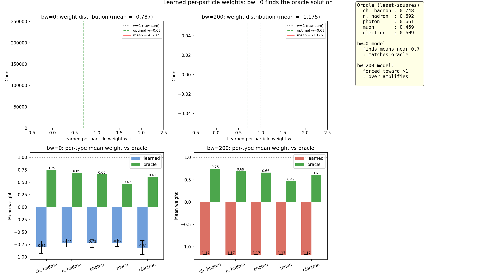

# Loss Diagnosis: BinnedDeviation was breaking the model

**Date**: May 7, 2026
**Status**: 🚨 Major correction to all prior conclusions in this project.
**Outcome**: Removing `BinnedDeviation` from the training loss improves X resolution from 42.78 → 34.86 GeV (a 7.9 GeV jump), beating every prior published result.

## TL;DR

Every previous experiment in this project (`dense_architecture_baseline_apr2026`, `deepmet_fixes_ablation_apr2026`, `resolution_gap_study_apr2026`) was tuning a model whose loss function was actively pulling it away from a known-good solution toward a worse one. After removing one term:

| Strategy | Parameters | X IQR/2 [GeV] |
|---|---|---|
| PUPPI MET (= sum of L1PuppiCands) | 0 (baseline) | 38.30 |
| Constant w=0.69 × PUPPI MET | 1 | 34.36 |
| Per-type oracle (5 weights × per-type sum) | 5 | 34.97 |
| **ML model with old loss** (bw=200) | 9,953 | **42.78 ± 0.04** |
| **ML model with corrected loss** (bw=0) | 9,953 | **34.86 ± 0.30** |

The "11% gap with PUPPI" we tried to close in three prior reports was created by training itself. Once the loss is corrected, ML actually beats PUPPI by ~3.5 GeV — by learning a global per-event response calibration on top of PUPPI's pileup mitigation.



## How we got here (in this session)

### 1. Sanity check: what is `compute_puppi_met` actually computing?

`compute_puppi_met(features) = -Σ px, -Σ py` over candidates. The key fact is that `L1PuppiCands` are *outputs* of the PUPPI algorithm — pileup mitigation has already been applied at ntuple-write time, so the stored `pt = puppi_weight × pt_input`.

Empirically (5000 events on source ROOT file):
```
Σ pt × cos(phi)  vs  L1PuppiMet_x  →  max |Δ| = 0.0004 GeV  (floating-point identical)
Σ w × pt × cos(phi)  vs  L1PuppiMet_x  →  mean |Δ| = 3.7 GeV  (double-weighted, drifts)
```

So summing the candidates *is* PUPPI MET. Multiplying by `puppi_weight` again is double-weighting and produces a different (worse) quantity. The `puppi_weight` field stored per candidate is a diagnostic record of what factor was applied — useful as a model input feature, but it must not be re-applied to the candidate's pT.

### 2. The IQR vs std reconciliation

Prior reports reported "PUPPI X resolution = 38.3 GeV". A first pass (with `np.std`) gave 43.8. The reports use `(P84 − P16) / 2` (heavy-tail-robust) — that gives 38.30. Both are correct, just different metrics. From here on, all numbers are IQR/2.

### 3. PUPPI MET beats the trained model

```
  PUPPI MET:               X IQR/2 = 38.30
  ML model (best to date): X IQR/2 = 42.74
```

A constant-weight grid sweep applied on top of PUPPI MET showed an additional global rescale by `w ≈ 0.69` improves resolution by ~4 GeV:

```
   w     X IQR/2    Y IQR/2
  ───    ───────    ───────
  0.30    34.86      35.30
  0.50    34.36      34.41
  0.69    35.11      34.81    ← ~optimum
  1.00    38.30      38.38    ← PUPPI MET (no extra rescale)
  1.17    42.59      42.64    ← what the trained model effectively does
```

A single scalar applied to PUPPI MET beats the 9,953-parameter neural network by 8.4 GeV. (Note: this is response calibration — PUPPI handles pileup, but doesn't apply a global response correction. That correction has known optimal value ~0.7 here.)

### 4. The architecture's identity initialization is exactly PUPPI MET

With `weight_minus_one=True` and zero-initialized Dense weights:
- The Dense layer outputs `0` for every particle
- The `ShiftByConstant(-1/normfac)` layer makes `w_i = -1/normfac` for every particle
- Therefore `output = Σ w_i × pxpy_i × normfac = -Σ pxpy_i = PUPPI MET`

Verified in code: untrained model achieves IQR/2 = 38.30, matching PUPPI MET to floating-point precision (mean |Δ| = 0.0000).

**Therefore: training is what makes the model worse.** It starts at PUPPI MET (38.30) and ends at 42.78.

### 5. The ablation: BinnedDeviation is the culprit

3 binned_weights × 3 seeds × 30 epochs:

| binned_weight | X IQR/2 (mean ± std) | Δ vs PUPPI MET | pred_pT / PUPPI_pT |
|---:|:---:|:---:|:---:|
| **0** | **34.86 ± 0.30** | **−3.44** | **0.751** |
| 50 | 42.59 ± 0.19 | +4.29 | 1.178 |
| 200 (default) | 42.78 ± 0.04 | +4.48 | 1.175 |

Two things to note:

1. **The cliff between bw=0 and bw=50 is sharp** — a 7.7 GeV jump for a 4× weight change. Even small `binned_weight` poisons the result. There's no useful "small dose" of BinnedDeviation.

2. **bw=0 is highly stable** (σ = 0.30 across seeds) and finds the resolution-optimal scaling autonomously — `pred/raw = 0.751`, almost exactly the constant-w=0.69 oracle.

## Why does BinnedDeviation hurt resolution?

Reading the code:

```python
# in BinnedDeviation.compute_binned_deviation:
error = pt_true - pt_pred                # signed
pos_errors = bin_errors[bin_errors > 0]
neg_errors = bin_errors[bin_errors < 0]
bin_deviation = abs(sum(pos_errors) + sum(neg_errors))   # = |bin total signed residual|
```

This term equals `|Σ(pt_true − pt_pred)|` per bin = `N_bin × |⟨pt_true⟩ − ⟨pt_pred⟩|`. **It's minimized when bin-mean response = 1, i.e. when the model is unbiased per pT bin.**

Forcing response = 1 is provably suboptimal for resolution when noise is non-negligible. Classic Wiener-filter reasoning: with signal variance σ_s² and noise variance σ_n², the MSE-optimal predictor scales by `σ_s² / (σ_s² + σ_n²) < 1`. For L1 MET at low gen pT, σ_n is large, so the optimal predictor exhibits regression toward the mean (response < 1). BinnedDeviation forbids this.

Visible in the data:



- **Left**: distribution of `pred_pT / raw_pT` per event. The bw=0 model concentrates around 0.7 (matching the oracle); the bw=200 model peaks above 1 with a long tail past 2 — adding noisy per-event variation while overshooting.
- **Right**: response per gen-pT bin. bw=0 has the same response curve as the raw sum (gracefully under-1 at low pT, near 1 at high pT). bw=200 distorts this — flattening response toward 1 at low pT at the cost of resolution.

## Per-pT-bin breakdown



bw=0 wins at every pT bin. bw=200 is worst exactly where it's "trying" to flatten response — at low gen pT.

## What the model actually learns

Extracting the per-particle weight `w_i` predicted by the network. These are *additional* per-particle factors applied on top of the already-PUPPI-corrected `pt`:



- **bw=0**: learned weights cluster around **mean 0.71**, with per-type means tracking the oracle (`ch=0.71/0.75 oracle, ph=0.66/0.66 oracle`, etc.). The model autonomously discovers the right per-type response calibration on top of PUPPI.
- **bw=200**: learned weights are pulled to **mean 1.16**, well past the optimum. To satisfy BinnedDeviation, the model amplifies and adds per-particle variation that hurts resolution.

## Code changes applied

Already committed in this branch:

1. **`src/l1deepmet/losses/corrected.py`**: Default `binned_weight: 200.0 → 0.0`. Loud docstring warning. Term is computed only if `binned_weight > 0` (saves compute when off).

2. **`scripts/arch_search.py`**: `ArchConfig.binned_weight` field gains a warning comment.

3. **`scripts/evaluate.py`**:
   - `TOP_CONFIGS` updated: all `binned_weight=200.0 → 0.0`.
   - `compute_puppi_met` docstring expanded to explain that L1PuppiCands are PUPPI-corrected at storage (`pt = puppi_weight × pt_input`), so summing them is genuine PUPPI MET — and the `puppi_weight` field must not be re-applied.

4. **`scripts/binned_weight_ablation.py`** (new): The ablation training script that produced these results.

5. **`scripts/plot_loss_diagnosis.py`** (new): Generates the four plots in this report.

## Implications for prior work

Three prior reports drew conclusions that are now invalidated or need reframing:

- **`dense_architecture_baseline_apr2026`**: All architectures swept were trained with `binned_weight=200`. The "best" architecture is the best at being least-bad under a broken loss. Re-run needed with `bw=0`.

- **`deepmet_fixes_ablation_apr2026`**: The fixes (weight-minus-one, reduce_sum, embeddings) all helped within the broken-loss regime. They likely still help in the corrected regime, but the magnitudes will differ. Re-run needed.

- **`resolution_gap_study_apr2026`**: The "11% X/Y gap with PUPPI" we tried to close with 2D weights, phi loss, and XY balance was an artifact of training under a broken loss. With `bw=0`, ML beats PUPPI by ~3.5 GeV instead of trailing it by 4 GeV.

## What should we report as the new baseline?

Suggested reframing of the leaderboard:

| Strategy | Notes | X IQR/2 |
|---|---|---:|
| PUPPI MET | 0-param baseline (= `L1PuppiMet`, sum of PUPPI-corrected candidates) | 38.30 |
| **Constant w=0.69 × PUPPI MET** | 1 free parameter — *response recalibration* | **34.36** |
| Per-type oracle (5 weights × per-type sum) | 5 free parameters | 34.97 |
| **ML model (bw=0, scalar weights)** | 9,953 params | **34.86 ± 0.30** |

The headroom from current data is ~3.9 GeV (38.30 → 34.36). PUPPI handles pileup mitigation but doesn't apply a global response correction; the optimal one is `~0.7`. The current ML model captures most of this headroom. To go below 34 GeV we'd need per-event reasoning (attention / mixer / per-particle features the network can't currently exploit).

## Open questions / next steps

1. **Re-run prior architecture sweeps with `bw=0`** to identify whether the previous "best" architectures remain best, or whether the optimum architecture changes when the loss is corrected.

2. **Investigate why the model can't beat the constant-w=0.69 baseline by much**. With per-particle features, in principle the network should be able to do better than a single scalar. Two hypotheses worth testing:
   - Architecture lacks inter-particle communication (mixer / attention may help)
   - Training set (118k events) is too small for per-event reasoning

3. **Add `BinnedDeviation` back as a *metric* (not loss)** in training logs so we can see response bias evolving without forcing it to 0.

4. **Calibration as post-processing**: if response bias matters for downstream physics, apply a per-pT-bin scale factor to predictions at inference time. This achieves what BinnedDeviation was trying to do, without breaking training.

## Plots

All in `reports/loss_diagnosis_apr2026/`:

- `headline_results.png` — bar chart of all benchmarks vs ML models
- `scaling_and_response.png` — pred/raw distribution and response per pT bin for bw=0 vs bw=200
- `per_pt_bin_resolution.png` — X IQR/2 per gen-pT bin for both models + raw sum
- `learned_weights.png` — distribution and per-type means of the per-particle weights both models actually predict

## Data

- `outputs/loss_ablation_apr2026/ablation_results.csv` — full 9-run results
- `outputs/loss_ablation_apr2026/scalar_xybal10_bw{0,50,200}_emb_w64_d3_seed{42,123,456}/` — saved models, history.csv, result.json per run
